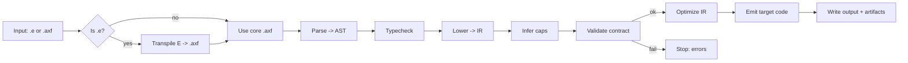

# Full compile pipeline

`.e/.axf` -> (transpile if .e) -> validate contract -> compile -> optimize -> emit -> artifacts

```mermaid
flowchart LR
  A[Input: .e or .axf] --> B{Is .e?}
  B -- yes --> C[Transpile E -> .axf]
  B -- no --> D[Use core .axf]
  C --> D
  D --> E[Parse -> AST]
  E --> F[Typecheck]
  F --> G[Lower -> IR]
  G --> H[Infer caps]
  H --> I[Validate contract]
  I -->|ok| J[Optimize IR]
  J --> K[Emit target code]
  K --> L[Write output + artifacts]
  I -->|fail| X[Stop: errors]
```
